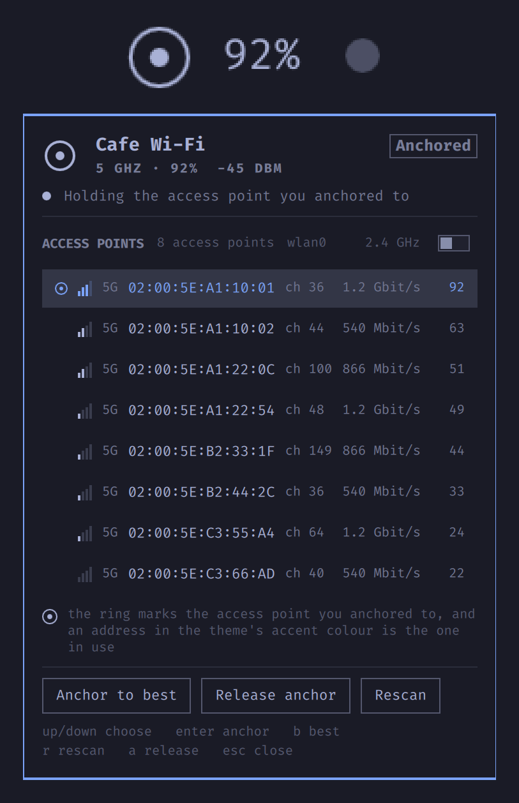

# OmaWiFi - Wi-Fi Anchor

An Omarchy bar widget for one problem: you are on a Wi-Fi network that several
access points broadcast, the machine keeps picking the wrong one, and you want to
hold the right one.

It shows every access point of the network you are on, with band, channel, link
rate and signal, and pins the connection to the one you pick. The pin lives in
the NetworkManager profile (`802-11-wireless.bssid`), so it survives a reconnect,
a lid close and a reboot, and it can be released again at any time.

It never reads, writes, or stores your Wi-Fi password, or any other credential.
All it reads is what NetworkManager already knows about the access points around
you, their address, band, channel and signal, and the only thing it ever writes
is a single field on the network's own profile: which access point to prefer.
The network names and addresses in the screenshot below are made-up examples.



## What the mark means

The bar shows a drawn mark (a ring with a dot inside, not the font's Wi-Fi fan,
because Omarchy's own link indicator already uses that) plus the signal of the
access point in use. The dot's position is the state, so it reads without
relying on colour:

| Mark | Colour | State | Meaning |
| --- | --- | --- | --- |
| dot centred in the ring | your theme's bar text | Anchored | the radio is on the access point you pinned |
| dot pushed to the edge | urgent | Drifted | the radio slipped off it |
| hollow ring and dot | dimmed text | Roaming | nothing pinned, NetworkManager chooses |
| no dot | faint text | Offline | not associated |

## Using it

| Action | Result |
| --- | --- |
| left click the mark | open the panel |
| middle click | rescan |
| right click | anchor to the best access point, without opening anything |

Inside the panel:

| Key | Result |
| --- | --- |
| up / down | move the cursor |
| enter | anchor to the access point under the cursor |
| b | anchor to the best access point |
| r | rescan |
| a | release the anchor |
| esc | close |

Hovering the bar mark shows a tooltip with the full picture: the access point in
use, the one anchored, and how many are visible.

The panel can also be driven from a keyboard shortcut or a script, which is handy
for a Hyprland binding:

```sh
omarchy-shell io.github.hectorhache.omawifi toggle   # open or close
omarchy-shell io.github.hectorhache.omawifi open     # open
omarchy-shell io.github.hectorhache.omawifi close    # close
omarchy-shell io.github.hectorhache.omawifi scan     # rescan
omarchy-shell io.github.hectorhache.omawifi anchorBest
omarchy-shell io.github.hectorhache.omawifi clearAnchor
```

## Install

```sh
omarchy plugin add https://github.com/HectorHache/omarchy-omawifi --enable
```

With `--enable`, Omarchy asks which bar section to place it in, left, center or
right, defaulting to right (next to the other status widgets). Leave off
`--enable` to add it now and enable it later.

Enabling by hand, with the same section choice:

```sh
omarchy plugin enable io.github.hectorhache.omawifi --section right   # or center, left
```

You can move it between sections at any time by running that command again with
a different `--section`, or with `--before <widget-id>` / `--after <widget-id>`
/ `--index <n>` to place it precisely.

Installing from a local clone instead of a git URL, use the bundled helper. It
validates the plugin, copies it in, asks the same left/center/right question and
reloads the shell:

```sh
./install.sh            # prompts for the section (default: right)
./install.sh center     # or pass it directly
```

If enabling ever answers "is not known", run `omarchy-shell shell rescanPlugins`
once and try again. Reload the shell with `pkill -x quickshell` if it does not
pick the plugin up on its own.

## Removing it

```sh
omarchy plugin disable io.github.hectorhache.omawifi
omarchy plugin remove io.github.hectorhache.omawifi
```

If you had anchored to an access point, release it first (press `a` in the
panel, or run `omarchy-shell io.github.hectorhache.omawifi clearAnchor`) so no
pinned BSSID is left behind in the NetworkManager profile. Removing the plugin
does not touch your saved networks on its own.

## Settings

Set from the shell's plugin settings, or by editing the widget entry in
`~/.config/omarchy/shell.json`.

| Setting | Default | What it does |
| --- | --- | --- |
| Network name | empty | Leave empty to follow whatever network the machine is on. Set it to keep the widget on one network by name. |
| Preferred band | 5 GHz | Which band the anchor aims at. 5 GHz is usually faster and normally has several access points of the same network to choose between; 2.4 GHz reaches further. |
| Show the signal percentage | on | The percentage beside the mark. Off makes the widget one icon narrower. |
| Check the anchor every | 20 s | How often the bar asks which access point the radio is on. This is a read, not a scan, and costs nothing. |
| Refresh the open panel every | 5 s | While the panel is open, because signal moves as you walk. |
| Pin the band as well as the access point | off | Off, pinning the access point alone lets the machine fall back to the other band when it cannot reach the pinned one instead of refusing to connect. |
| Rank on signal alone | off | Off, close calls are refined by two tie-breaks (see below). |
| Show the ranking score | on | The number the order is decided by, for when two access points report the same signal percentage. |

## How the ranking works

Best first, and the first row is what "Anchor to best" picks.

1. Signal, strongest first.
2. Within a close call, an access point sharing its channel with others in the
   list is marked down: contention is what actually costs you throughput.
3. Within that, a DFS channel is marked down, because radar detection can force
   a reassociation.

Choosing the strongest access point and then refusing to budge is the whole
point. That said, an anchor is only worth setting to an access point the radio
can actually associate with: if the pinned one stops answering, release the
anchor and let NetworkManager pick.

## Notes

- Reading is done with `nmcli`, and the same commands work unchanged without the
  widget: `scripts/omawifi ui` prints one JSON snapshot, `scripts/omawifi bind
  <BSSID>` pins one access point by hand.
- Changing the pin needs NetworkManager's
  `org.freedesktop.NetworkManager.settings.modify.system` permission. Started
  from the shell, the polkit agent authorises it without a password. From a plain
  terminal in a headless or remote session it may not, in which case the script
  says so instead of failing silently.
- The widget only ever touches the profile of the network it is looking at, and
  restores the previous pin if it cannot associate to the new one.
- No external dependencies beyond `bash`, `nmcli` and what Omarchy already
  ships. The mark and the signal bars are drawn with Qt primitives, so no Nerd
  Font glyph has to be present for the widget to render.
- The "2.4 GHz" switch inside the panel shows the other band for the current
  session only. It is a look, not a setting.

## Known limitations

- NetworkManager only. Reading and pinning both go through `nmcli`. On a machine
  running iwd or systemd-networkd directly (without NetworkManager) the widget
  has nothing to talk to. Omarchy ships NetworkManager, so this is only a concern
  off the beaten path.
- The pin needs polkit to allow `settings.modify.system` for the shell. This is
  the case on a normal Omarchy desktop session; a locked-down polkit policy can
  refuse it, and then binding fails with a message instead of silently.
- Anchoring works against fast roaming. If your network uses 802.11r/k/v to hand
  you between access points on purpose, pinning one fights that. Release the
  anchor (`a`, or "Release anchor") to let it roam again.
- The channel and band read comes from `nmcli`, with `iw` used when present for
  the exact frequency. An unusual regulatory domain can make the 5 GHz / 2.4 GHz
  and DFS classification approximate.
- English only. All labels and messages are hard-coded English; there is no
  translation layer yet.

## License

MIT. See [LICENSE](LICENSE).
